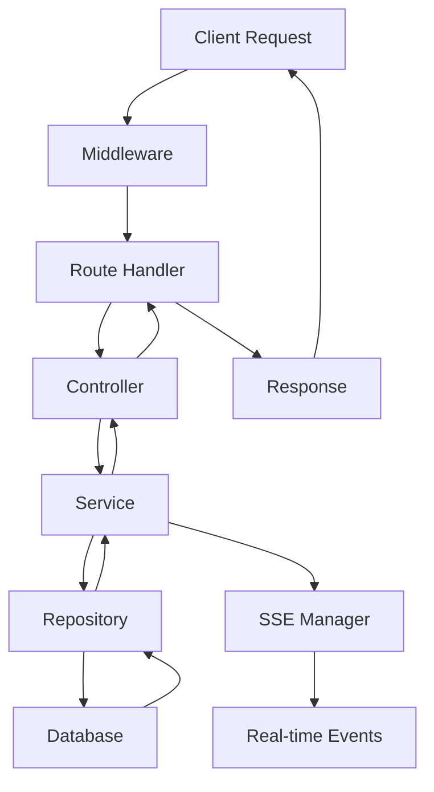
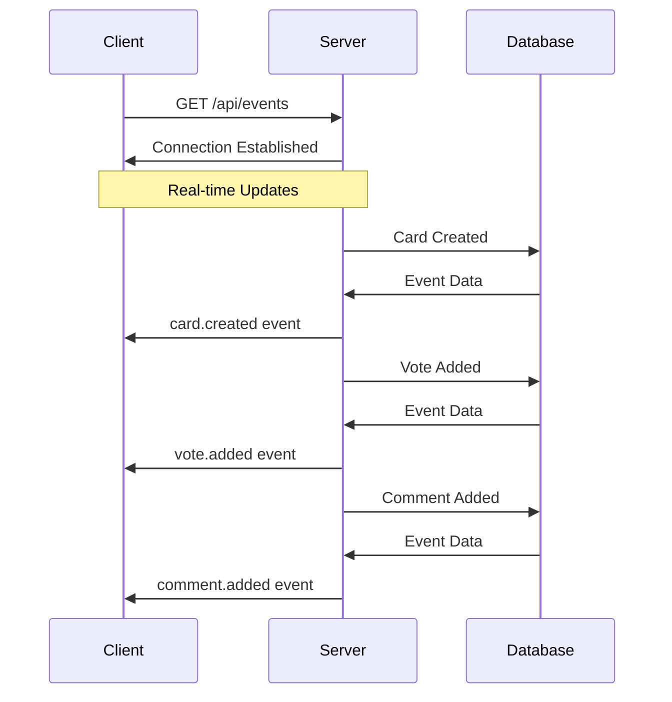
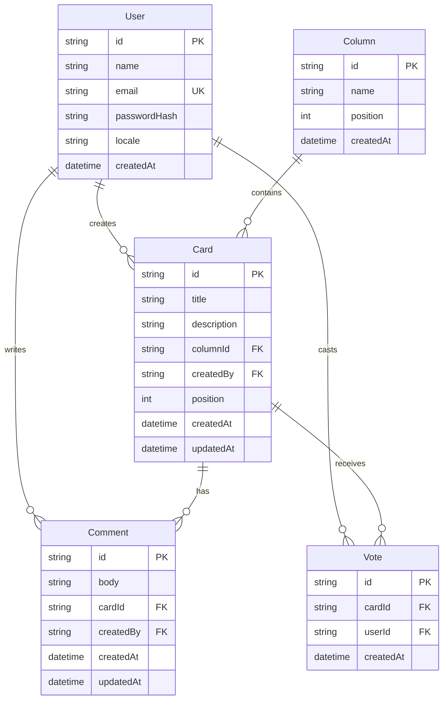
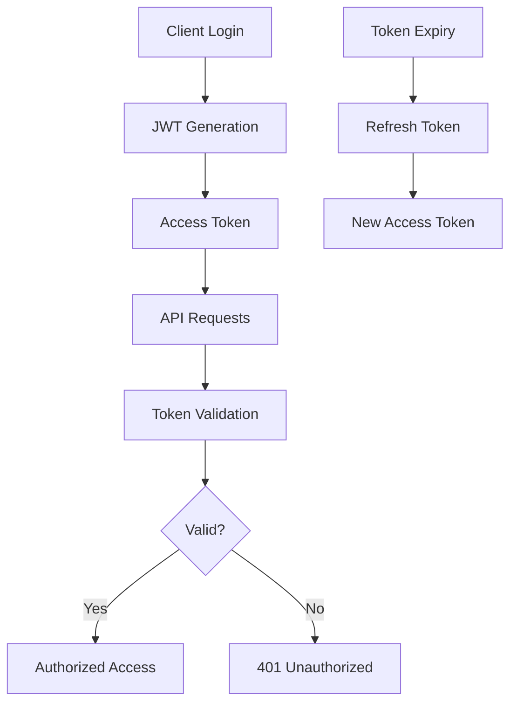
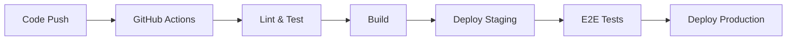

# 🏗️ Arquitetura do Kanban de Ideias

## 📋 Visão Geral

O Kanban de Ideias é uma aplicação full-stack moderna que implementa uma arquitetura limpa e escalável, seguindo princípios de separação de responsabilidades e design patterns estabelecidos.

## 🎯 Princípios Arquiteturais

### 1. **Clean Architecture**
- Separação clara entre camadas (Presentation, Business, Data)
- Dependências apontam para dentro (Dependency Inversion)
- Independência de frameworks e tecnologias externas

### 2. **SOLID Principles**
- **S**ingle Responsibility: Cada classe tem uma única responsabilidade
- **O**pen/Closed: Aberto para extensão, fechado para modificação
- **L**iskov Substitution: Subclasses podem substituir suas classes base
- **I**nterface Segregation: Interfaces específicas e focadas
- **D**ependency Inversion: Dependência de abstrações, não implementações

### 3. **Domain-Driven Design (DDD)**
- Modelos de domínio ricos e expressivos
- Agregados bem definidos
- Eventos de domínio para comunicação entre bounded contexts

## 🏛️ Arquitetura do Backend

### Estrutura de Camadas

```
┌─────────────────────────────────────┐
│           Presentation Layer        │
│  (Controllers, Routes, Middleware)  │
├─────────────────────────────────────┤
│           Business Layer            │
│         (Services, Use Cases)       │
├─────────────────────────────────────┤
│            Data Layer               │
│      (Repositories, Database)       │
└─────────────────────────────────────┘
```

### Camadas Detalhadas

#### 1. **Presentation Layer** (`src/controllers/`, `src/routes/`)
- **Responsabilidade**: Interface HTTP, validação de entrada, formatação de resposta
- **Componentes**:
  - Controllers: Processam requisições HTTP
  - Routes: Definem endpoints e middlewares
  - Middleware: Autenticação, CORS, rate limiting, validação

#### 2. **Business Layer** (`src/services/`)
- **Responsabilidade**: Lógica de negócio, regras de domínio, orquestração
- **Componentes**:
  - Services: Implementam casos de uso
  - Domain Logic: Regras específicas do negócio
  - Event Handlers: Processam eventos de domínio

#### 3. **Data Layer** (`src/repositories/`)
- **Responsabilidade**: Persistência, acesso a dados, queries
- **Componentes**:
  - Repositories: Abstração do acesso a dados
  - Database: Prisma ORM + SQLite/PostgreSQL
  - Migrations: Versionamento do schema

### Fluxo de Dados



## 🎨 Arquitetura do Frontend

### Estrutura de Camadas

```
┌─────────────────────────────────────┐
│         Presentation Layer          │
│    (Components, Pages, UI)          │
├─────────────────────────────────────┤
│          Application Layer          │
│      (Services, Hooks, State)       │
├─────────────────────────────────────┤
│           Domain Layer              │
│         (Types, Models)             │
└─────────────────────────────────────┘
```

### Padrões Implementados

#### 1. **Component Architecture**
- **Atomic Design**: Atoms → Molecules → Organisms → Templates
- **Composition over Inheritance**: Hooks e composição de componentes
- **Single Responsibility**: Cada componente tem uma função específica

#### 2. **State Management (Zustand)**
- **Centralized State**: Estado global acessível
- **Immer Integration**: Mutations imutáveis
- **Selectors**: Acesso otimizado ao estado
- **Actions**: Métodos para modificar estado

#### 3. **Service Layer**
- **API Abstraction**: Camada de abstração para chamadas HTTP
- **Error Handling**: Tratamento centralizado de erros
- **Type Safety**: Tipagem forte com TypeScript

## 🔄 Comunicação em Tempo Real

### Server-Sent Events (SSE)



### Event Types

```typescript
type KanbanEvent = 
  | { type: 'card.created'; payload: Card }
  | { type: 'card.updated'; payload: Card }
  | { type: 'card.moved'; payload: MoveEvent }
  | { type: 'card.deleted'; payload: { cardId: string } }
  | { type: 'vote.added'; payload: Vote }
  | { type: 'vote.removed'; payload: { cardId: string; userId: string } }
  | { type: 'comment.added'; payload: Comment }
  | { type: 'comment.updated'; payload: Comment }
  | { type: 'comment.deleted'; payload: { commentId: string; cardId: string } };
```

## 🗄️ Modelo de Dados

### Entidades Principais



### Relacionamentos

1. **User → Card**: 1:N (Usuário pode criar múltiplos cards)
2. **User → Comment**: 1:N (Usuário pode escrever múltiplos comentários)
3. **User → Vote**: 1:N (Usuário pode votar em múltiplos cards)
4. **Column → Card**: 1:N (Coluna pode conter múltiplos cards)
5. **Card → Comment**: 1:N (Card pode ter múltiplos comentários)
6. **Card → Vote**: 1:N (Card pode receber múltiplos votos)

## 🔐 Segurança

### Autenticação e Autorização



### Middlewares de Segurança

1. **Helmet**: Headers de segurança HTTP
2. **CORS**: Controle de origem cruzada
3. **Rate Limiting**: Proteção contra spam/DoS
4. **Input Validation**: Validação com Zod
5. **JWT Verification**: Verificação de tokens

## 📊 Performance e Escalabilidade

### Estratégias Implementadas

#### Backend
- **Connection Pooling**: Prisma com pool de conexões
- **Query Optimization**: Índices e queries otimizadas
- **Caching**: Cache de consultas frequentes
- **Compression**: Gzip para responses

#### Frontend
- **Code Splitting**: Carregamento sob demanda
- **Lazy Loading**: Componentes carregados quando necessário
- **Memoization**: React.memo e useMemo
- **Virtual Scrolling**: Para listas grandes

### Métricas de Performance

- **API Response Time**: < 300ms
- **SSE Latency**: < 1s
- **Bundle Size**: < 500KB (gzipped)
- **First Contentful Paint**: < 1.5s

## 🧪 Estratégia de Testes

### Pirâmide de Testes

```
        ┌─────────┐
        │   E2E   │  ← Poucos, mas críticos
        ├─────────┤
        │Integration│  ← Testes de API e componentes
        ├─────────┤
        │   Unit   │  ← Muitos, rápidos e isolados
        └─────────┘
```

### Tipos de Testes

#### Backend
- **Unit Tests**: Services, repositories, utilities
- **Integration Tests**: API endpoints, database operations
- **Security Tests**: Authentication, authorization, validation

#### Frontend
- **Component Tests**: Renderização, props, eventos
- **Hook Tests**: Custom hooks, state management
- **Integration Tests**: User flows, API integration

## 🚀 Deploy e DevOps

### Ambientes

1. **Development**: Local com hot reload
2. **Staging**: Ambiente de testes
3. **Production**: Ambiente de produção

### CI/CD Pipeline



### Monitoramento

- **Health Checks**: Endpoints de saúde
- **Logging**: Structured logging
- **Metrics**: Performance e uso
- **Error Tracking**: Sentry ou similar

## 🔮 Roadmap Técnico

### Fase 1 (Atual)
- ✅ Backend REST API
- ✅ Frontend React
- ✅ Autenticação JWT
- ✅ SSE para tempo real
- ✅ Drag & Drop

### Fase 2 (Próxima)
- 🔄 WebSocket para tempo real
- 🔄 Notificações push
- 🔄 Anexos de arquivos
- 🔄 Relatórios e analytics

### Fase 3 (Futuro)
- 🔄 Mobile app (React Native)
- 🔄 Integração com ferramentas externas
- 🔄 IA para sugestões
- 🔄 Colaboração avançada

## 📚 Referências

- [Clean Architecture - Robert Martin](https://blog.cleancoder.com/uncle-bob/2012/08/13/the-clean-architecture.html)
- [Domain-Driven Design - Eric Evans](https://domainlanguage.com/ddd/)
- [React Patterns](https://reactpatterns.com/)
- [Prisma Best Practices](https://www.prisma.io/docs/guides/performance-and-optimization)
- [Node.js Security Best Practices](https://nodejs.org/en/docs/guides/security/)
